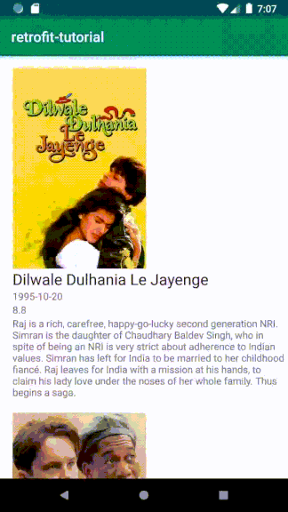
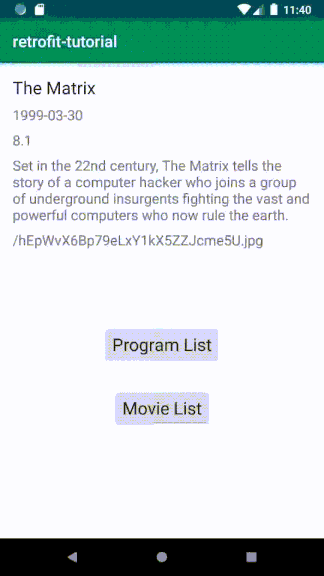

# android-retrofit-tutorial

This tutorial/lab aims to provide hands-on experience of building an Android app that retrieves and displays data with REST API. We will first introduce how to:

1. Use [Retrofit](https://square.github.io/retrofit/) to retrieve data of single movie from [The Movie DB](https://www.themoviedb.org/) and display the data in an Activity.
2. Use [RecyclerView](https://developer.android.com/guide/topics/ui/layout/recyclerview) to display a list of textual data

You will then be asked to modify the provided classes to show a list of top-rated movies, as illustrated below.





This tutorial assumes that you know some [Android basics](https://developer.android.com/training/basics/firstapp) such as Activities and layouts, and able to create a simple Android app with Android Studio.


## Running the Source Code

1. To run the tutorial code, you need an API key from The Movie DB. Follow [this instruction](https://developers.themoviedb.org/3/getting-started/introduction) to create an account on The Movie DB and get your API key.

2. `git clone` this project, and import it with Android Studio. Replace `"YOUR_API_KEY"` in `MainActivity.java` with your API key. Run the app on an emulator (it is tested on Android 8.1 (API Level 27), but should work fine with API 23+)

3. Once the app is running, you will see movie data displayed on the main screen. The "Program List" button leads you to `ProgramListActivity` that displays a list of strings using `RecyclerView`. The "Movie List" button leads you to `MovieListActivity` that you are asked to finish in this lab.

   




## Using Retrofit to Retrieve and Display Data with REST API

The required data of single movie can be retrieved by the following REST API:

https://api.themoviedb.org/3/movie/603?api_key=YOUR_API_KEY&language=en-US

```json
{
  "adult": false,
  "backdrop_path": "/icmmSD4vTTDKOq2vvdulafOGw93.jpg",
  "belongs_to_collection": {},
  "budget": 63000000,
  "genres": [],
  "homepage": "http://www.warnerbros.com/matrix",
  "id": 603,
  "imdb_id": "tt0133093",
  "original_language": "en",
  "original_title": "The Matrix",
  "overview": "Set in the 22nd century, The Matrix tells the story of a computer hacker who joins a group of underground insurgents fighting the vast and powerful computers who now rule the earth.",
  "popularity": 34.575,
  "poster_path": "/hEpWvX6Bp79eLxY1kX5ZZJcme5U.jpg",
  "release_date": "1999-03-30",
  "title": "The Matrix",
    
  "..."
}
```

The fields we need in this tutorial are: `title`, `release_date`, `vote_average`, `overview`, and `poster_path`.

First, create a `Movie` class to hold the data returned by the API:

``` java
public class Movie {
    @SerializedName("vote_average")
    private Float voteAverage;
    @SerializedName("poster_path")
    private String posterPath;
    @SerializedName("title")
    private String title;
    @SerializedName("release_date")
    private String releaseDate;
    @SerializedName("overview")
    private String overview;

    public Movie(Float voteAverage, String posterPath, String title, String releaseDate, String overview) {
        this.voteAverage = voteAverage;
        this.posterPath = posterPath;
        this.title = title;
        this.releaseDate = releaseDate;
        this.overview = overview;
    }
    
    // ... Getters for the above fields
}
```

Next, create an interface class, `MovieApiService`, to bridge HTTP API:

```java
public interface MovieApiService {
    @GET("movie/{id}")
    Call<Movie> getMovie(@Path("id") int id, @Query("api_key") String apiKey);
}
```

Now you can generate a `Retrofit` object that creates the implementation of `MovieApiService` in `MainActivity`. Each `Call` from the created `MovieApiService` makes an HTTP request to the remote webserver.

```java
String BASE_URL = "https://api.themoviedb.org/3/";
String API_KEY = "YOUR_API_KEY";

retrofit = new Retrofit.Builder()
         .baseUrl(BASE_URL)
         .addConverterFactory(GsonConverterFactory.create())
         .build();
MovieApiService movieApiService = retrofit.create(MovieApiService.class);
Call<Movie> call = movieApiService.getMovie(603, API_KEY);
```

`Call` can be executed synchronously or asynchronously. However, a synchronous call means that the main/UI thread will be completely blocked until the operation completes---this is not recommended and not allowed in Android. Therefore, we make an asynchronous request with `call.enqueue()` as follows:

```java
call.enqueue(new Callback<Movie>() {
    @Override
    public void onResponse(Call<Movie> call, Response<Movie> response) {
        int[] ids = {R.id.txtTitle, R.id.txtReleaseDate, R.id.txtPoster,
                R.id.txtVote, R.id.txtOverview};
        String[] values = {
                response.body().getTitle(),
                response.body().getReleaseDate(),
                response.body().getPosterPath(),
                response.body().getVoteAverage().toString(),
                response.body().getOverview()
        };
        TextView tv;
        for (int i=0; i < ids.length; i++) {
            tv = findViewById(ids[i]);
            tv.setText(values[i]);
        }
    }
    
    @Override
    public void onFailure(Call<Movie> call, Throwable throwable) {
        Log.e(TAG, throwable.toString());
    }
});
```

This way, Android executes the request in a separate thread and does not block the main/UI thread. 


## Using RecyclerView to Display a List of Strings

The `RecyclerView` widget is a more advanced and flexible version of `ListView`. It has several advantages such as the ability to dynamically create list items and to cache and reuse the scrolled-out items (check [here](https://developer.android.com/guide/topics/ui/layout/recyclerview) for details). However, it is a little bit complex to use. Here are the required steps to use `RecyclerView`:

1. Add a `RecyclerView` widget to the layout file of the Activity (`activity_program_list.xml`)

2. Create an additional layout file (`program_row.xml`) to display single item in the list

3. Create an Adapter class (`ProgramListAdapter.java`) that extends `RecyclerView.Adapter` to feed your data to the list. In the Adapter class, we need to:

* Declare a ViewHolder class that extends `RecyclerView.ViewHolder`, responsible for displaying single item with a view.

```java
public class ViewHolder extends RecyclerView.ViewHolder {
    TextView tv;
    ViewHolder(View itemView) {
        super(itemView);
        tv = itemView.findViewById(R.id.tvProgramName);
    }
}
```

* Overwrite three built-in methods: 
  * `onCreateViewHolder()` (for creating a new ViewHolder with its corresponding layout)
  * `onBindViewHolder()` (for binding the data of single item to a view)
  * `getItemCount()` (for reporting the size of your dataset).

```java
public class ProgramListAdapter extends RecyclerView.Adapter<ProgramListAdapter.ViewHolder> {
    private List<String> mData;
        
    // ... Constructor of ProgramListAdapter
    // ... Declaration of the ViewHolder class

    @Override
    public ViewHolder onCreateViewHolder(ViewGroup parent, int viewType) {
        View view = LayoutInflater.from(parent.getContext()).inflate(R.layout.program_row, parent, false);
        return new ViewHolder(view);
    }

    @Override
    public void onBindViewHolder(ViewHolder holder, int position) {
        String program = mData.get(position);
        holder.tv.setText(program);
    }

    @Override
    public int getItemCount() {
        return mData.size();
    }
}
```

4. In `ProgramListActivity`, obtain a handle to the `RecyclerView` object, connect it to a layout manager, and attach an adapter for the data to be displayed.

```java
public class ProgramListActivity extends AppCompatActivity {
    private RecyclerView recyclerView;

    @Override
    protected void onCreate(Bundle savedInstanceState) {
        super.onCreate(savedInstanceState);
        setContentView(R.layout.activity_program_list);

        List<String> programs = new ArrayList<String>(
                Arrays.asList(
                        "Computer Science — Ph.D.",
                        "Computer Science — M.S.",
                        "Informatics — Ph.D.",
                    	...
                )
        );
        recyclerView = findViewById(R.id.rvPrograms);        
        recyclerView.setLayoutManager(new LinearLayoutManager(this));
        recyclerView.setAdapter(new ProgramListAdapter(programs));
    }
}
```

You have learned how to use Retrofit and RecyclerView. Now it is your turn to finish the following lab. 


## Lab: Complete the Provided Classes to Display Top-rated Movies

This lab asks you to display top-rated movies in `MovieListActivity`. The data can be retrieved from here:

https://api.themoviedb.org/3/movie/top_rated?api_key=YOUR_API_KEY

You have to display the 20 movies in the results returned by the above REST API.

All required class and layout files are provided in the project. Specifically, you have to modify the following four files:

* `MovieApiService.java`: add one more method for the above API
* `TopRatedResponse.java`: implement it as the `Movie` class
* `MovieListAdapter.java`: implement it as the `ProgramListAdadpter` class
* `MovieListActivity.java`: implement it as the `ProgramListActivity` class

Besides, you need to check `movie_row.xml` to know where to place the data when you modify `MovieListAdapter`. Note that, `movie_row.xml` contains a `ImageView` field for displaying the poster of a movie. The poster image can be retrieved with the following URL (refer to [here](https://developers.themoviedb.org/3/getting-started/images)):

https://image.tmdb.org/t/p/w500/POSTER_PATH

You also need to use [Picasso](https://square.github.io/picasso/) to download the poster image from the above URL and put it into the `ImageView` in your `MovieListAdapter`. 
